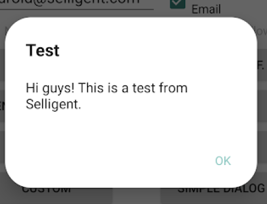

# Android – Using the SDK

## Foreword

Copyright

The contents of this manual cover material copyrighted by Marigold. Marigold reserves all intellectual property rights on the manual, which should be treated as confidential information as defined under the agreed upon software licence/lease terms and conditions.

The use and distribution of this manual is strictly limited to authorised users of the Marigold Interactive Marketing Software (hereafter the "Software") and can only be used for the purpose of using the Software under the agreed upon software licence/lease terms and conditions. Upon termination of the right to use the Software, this manual and any copies made must either be returned to Marigold or be destroyed, at the latest two weeks after the right to use the Software has ended.

With the exception of the first sentence of the previous paragraph, no part of this manual may be reprinted or reproduced or distributed or utilised in any form or by any electronic, mechanical or other means, not known or hereafter invented, included photocopying and recording, or in any information storage or retrieval or distribution system, without the prior permission in writing from Marigold.

Marigold will not be responsible or liable for any accidental or inevitable damage that may result from unauthorised access or modifications.

User is aware that this manual may contain errors or inaccuracies and that it may be revised without advance notice. This manual is updated frequently.

Marigold welcomes any recommendations or suggestions regarding the manual, as it helps to continuously improve the quality of our products and manuals.


## Table of Contents

<!--TOC-->
  - [Intro](#intro)
  - [Creating an Application](#creating-an-application)
    - [Google](#google)
  - [Including the SDK in your project](#including-the-sdk-in-your-project)
    - [SDK library](#sdk-library)
    - [Add the dependency](#add-the-dependency)
      - [Import the Marigold Engage library](#import-the-marigold-engage-library)
      - [minSdkVersion](#minsdkversion)
  - [Other libraries](#other-libraries)
  - [How to use the SDK](#how-to-use-the-sdk)
    - [Starting the SDK](#starting-the-sdk)
      - [Extending Application](#extending-application)
      - [Start](#start)
      - [Optional settings](#optional-settings)
    - [Device id](#device-id)
    - [Push notifications](#push-notifications)
      - [Permissions for Push notifications](#permissions-for-push-notifications)
      - [Listening to the push notifications and displaying the linked In-App message or executing the main action](#listening-to-the-push-notifications-and-displaying-the-linked-in-app-message-or-executing-the-main-action)
      - [Extending SMBaseActivity](#extending-smbaseactivity)
      - [Customization](#customization)
      - [Setting a specific icon](#setting-a-specific-icon)
      - [Setting a specific Activity](#setting-a-specific-activity)
      - [Design customization](#design-customization)
      - [Dialog](#dialog)
      - [Activities](#activities)
      - [Retrieving the Firebase Cloud Messaging (FCM) token from the SDK](#retrieving-the-firebase-cloud-messaging-fcm-token-from-the-sdk)
      - [Broadcast -- deprecated](#broadcast-deprecated)
      - [Observer](#observer)
      - [SMManager.getInstance().getGCMToken](#smmanager.getinstance.getgcmtoken)
      - [Enabling/disabling the notifications](#enablingdisabling-the-notifications)
      - [Setup for special push](#setup-for-special-push)
      - [Map](#map)
      - [Event](#event)
      - [Broadcasts -- deprecated](#broadcasts-deprecated)
      - [Observers](#observers)
      - [Manual display of a push notification](#manual-display-of-a-push-notification)
      - [Manual management of the push](#manual-management-of-the-push)
    - [In-App messages](#in-app-messages)
      - [Permissions](#permissions)
      - [Enabling/disabling the In App-messages](#enablingdisabling-the-in-app-messages)
      - [Reception of the messages](#reception-of-the-messages)
      - [Display of an In-App message](#display-of-an-in-app-message)
      - [Broadcasts -- deprecated](#broadcasts-deprecated)
      - [Observers](#observers)
    - [Events](#events)
      - [Registration/Unregistration](#registrationunregistration)
      - [SMEventUserRegister](#smeventuserregister)
      - [SMEventUserUnregister](#smeventuserunregister)
      - [Login/Logout](#loginlogout)
      - [SMEventUserLogin](#smeventuserlogin)
      - [SMEventUserLogout](#smeventuserlogout)
      - [Custom](#custom)
      - [SMEvent](#smevent)
    - [Broadcasts -- deprecated](#broadcasts-deprecated)
      - [Generic broadcasts](#generic-broadcasts)
      - [Local broadcasts](#local-broadcasts)
    - [Observers](#observers)
    - [Translations](#translations)
  - [Proguard](#proguard)
  - [Use cases](#use-cases)
    - [App with one activity](#app-with-one-activity)
    - [App with many activities](#app-with-many-activities)
    - [App with many activities and a Splash screen](#app-with-many-activities-and-a-splash-screen)
  - [Troubleshooting/FAQ](#troubleshootingfaq)
<!--/TOC-->

## Intro
The purpose of this document is to detail how to install the SDK into your App and how to easily start using it.
* For more detailed technical reference of the SDK please refer to <a href="MobileSDK%20Reference/sdk/com.selligent.sdk/index.md" target="_blank">Reference manual</a><a href="Android - MobileSDK Reference.pdf">**Android - MobileSDK Reference**</a>.
* For an example of implementation check the <a href="AndroidSDKTemplate.zip">**AndroidSDKTemplate**</a> project.

## Creating an Application

### Google
- If you already use push notifications (either yourself or through a third party library), simply re-use the Server Key and Sender ID you already have. If you don't already use it, we suggest you switch to integrating the json file given by the Firebase console.
- If you don't have any yet, go to https://console.firebase.google.com/ and sign in with a Google account.

<details>
  <summary>If you already have a project on Google Developer Console, click on "Import Google Project", otherwise click on "Create new project" and follow instructions.</summary><br/>
  
  
</details>

<details>
  <summary>Click on the Android icon and enter your package name.</summary><br/>
  
  
</details>

<details>
  <summary>Download the JSON file, put it in your app and update the gradle files as instructed on Firebase.</summary><br/>
  
  
</details>

<details>
  <summary>Inside your project, click on your app and then on the gear icon.</summary><br/>
  
  
</details>

<details>
  <summary>Click on the tab "Cloud Messaging", you will see the Server key and the Sender ID.</summary><br/>
  
  
</details>

- Note the Server key, you will have to give it to the Marigold Engage platform.


## Including the SDK in your project

### SDK library
To use our SDK, you can either add a dependency or create a new module containing the aar file.

### Add the dependency

Since 3.8.3, our SDK is available on Maven Central.

In the build.gradle file in your app module, add the following line:

```xml
implementation 'com.selligent.sdk:selligent_mobile_sdk:4.4.0'
```

You need to have MavenCentral in your list of repositories.

#### Import the Marigold Engage library
If you prefer to directly add the aar file, create a new module that will contain it. 

<details>
  <summary>To do this, open the Project Structure dialog and add a new dependency to the app module and choose "JAR/AAR dependency".</summary><br/>
  
  
</details>

And select the file. Once it is done, synchronize and build the project.

#### minSdkVersion
The `minSdkVersion` is `21`.

> The SDK was built using the Gradle Plugin 8.1.0

## Other libraries
You need to add some external dependencies in your app gradle file:
- Firebase messaging and Firebase-core 
  - If your version of Gradle is 5 or higher, you can simply add
    ```gradle
    implementation platform('com.google.firebase:firebase-bom:32.2.0')
    implementation 'com.google.firebase:firebase-messaging'
    ```
  - If you are using a lower version of Gradle, you need to specify the version of Firebase-messaging 
    ```gradle
    com.google.firebase:firebase-messaging:23.2.0
    ```
 
The version of Firebase must be at least 19 to be compatible with our SDK 3.x. Firebase 19 requires the use of the "AndroidX" libraries instead of the old "support" ones. 
The SDK was adapted to work with those new libraries, which means it will NOT work with the "support" ones anymore. 
For the same reason, any google-play-services library must be at least 17. 
> **If you haven't adapted your app to use AndroidX yet, please use a lower version of our SDK.**

If you followed the instructions given to you by Firebase (cf. Creating a Google application) to update your gradle files, you should have the following:
In the build.gradle file at project level: 
```gradle
dependencies { classpath 'com.google.gms:google-services:X.Y.Z' }
```
In the build.gradle file at app level, at the bottom:
```gradle
apply plugin: 'com.google.gms.google-services'
```

- Kotlin coroutines
```gradle
androidx.lifecycle:lifecycle-runtime-ktx:2.6.1
org.jetbrains.kotlinx:kotlinx-coroutines-android:1.7.3
```
  
- If you plan on sending Map type push, you need a dependency to play-services-maps:
```gradle
com.google.android.gms:play-services-maps
```

- GSON 
```gradle
com.google.code.gson:gson
```

- CardView 
```gradle
androidx.cardview:cardview
```

- WorkManager 
> **These two dependencies are mandatory if you are going to send encrypted push to your app or rich push.** 
```gradle
androidx.work:work-runtime:2.8.1
androidx.concurrent:concurrent-futures:1.1.0
```
> <br>They replace FirebaseJobDispatcher which is deprecated and not used anymore by the Marigold Engage SDK.


## How to use the SDK

### Starting the SDK

#### Extending Application
The SDK needs to be started in a class extending Application. 
If you do not already have one, create a new class, for example `MyApplication` that will extend `Application`:

```java
public class MyApplication extends Application { 
  @Override 
  public void onCreate() { 
    // Setup the SDK here
    super.onCreate(); 
  } 
}
```

On the `OnCreate` event, [setup the SDK](#start). 

In the AndroidManifest.xml file, add the following:
```xml
<application 
  android:name=".MyApplication" 
  …       
```
                                                                                                                   
#### Start
To start the SDK, in your class extending `Application` , use the following: 
```java
SMManager.getInstance().start(settings, this);
```

`this` is of course the instance of the class extending Application. 

`settings` is an `SMSettings` object, proposing the following properties

| Property | Description |
| --------- | --------- |
| `WebServiceUrl` | URL of the Marigold Engage web service that will be called. It is given by Marigold. |
| `GoogleApplicationId` | Deprecated, you can leave it to null as long as you use the JSON file given by Firebase. |
| `ClientId` | Public key allowing the connection to the web service. It is given by Marigold. |
| `PrivateKey` | Private key allowing the connection to the web service. It is given by Marigold. |

```java
SMSettings settings = new SMSettings();
settings.WebServiceUrl = "https://www.some.web.service.com";
settings.ClientId = "SomeClientId";
settings.PrivateKey = "SomePrivateKey";

SMManager.getInstance().start(settings, this);
```

#### Optional settings
There are optional settings on `SMSettings`:

| Property | Description |
| --------- | --------- |
| `ClearCacheIntervalValue` | You can set it to change the way the SDK manages the cache. It is recommended to leave it to its default value of `Auto`. |
| `InAppMessageRefreshType` | Setting this value will enable the In-App messages. It tells how often the SDK must retrieve the In-App messages. |
| `InAppContentRefreshType` | Setting this value will enable the In-App contents. It tells how often the SDK must retrieve the In-App contents. |
| `RemoteMessageDisplayType` | Setting this value will enable/disable the automatic display of remote messages as they are received when the app is in foreground. <br><br> `Automatic`: the message will be displayed right away <br> `Notification`: a notification will be created and the message will be displayed after clicking on it. <br> `None`: nothing will be done, the app will have to manage the display. <br><br> When the app is in background, a notification will always be displayed unless `DoNotListenToThePush` is `true`. |
| `LoadCacheAsynchronously` | Setting this value to true will make the SDK load the cache at start using a separate thread, making the loading asynchronously. This will improve the performance but has an impact on how you retrieve contents, especially the In-App contents. When set to true, it is recommended to use the method returning the In-App contents using a callback. <br> Its default value is `false`. |
| `DoNotFetchTheToken` | Setting this value to true will prevent the SDK from fetching the token. Instead, you will have to do it yourself and give it to the SDK using the following method: `SMManager.getInstance().setFirebaseToken(String token)`. <br> Its default value is `false` |
| `DoNotListenToThePush` | Setting this value to true will prevent the SDK from listening to the push. Instead, you will have to do it yourself and either give it to the SDK using the following method: `SMManager.getInstance().displayNotification(Context context, Intent intent)` or use the SDK to retrieve the payload from the intent and then manage the notification yourself. <br> Its default value is `false` |
| `NotificationChannelId` | This will tell use an existing notification channel. If there is no channel with that id, one will be created. The default value is the id of the default channel used by the SDK. |
| `NotificationChannelName` | This will specify the name of the notification channel, that will be visible in the Settings of the device. If the notification channel does not exist yet, it will be created with that name, otherwise, the channel will be updated if needed (it will NOT be updated if the name is null, empty, equal to the current value or the default one). <br> Default value is `SMDefaultChannel`. |
| `NotificationChannelDescription` | This will specify the description of the notification channel, that will be visible in the Settings of the device. If the notification channel does not exist yet, it will be created with that description, otherwise, the channel will be updated if needed (it will NOT be updated if the description is null, empty, equal to the current value or the default one). <br> Default value is an empty string. |
| `EnableNotifications` | This will tell the SDK if the push notifications must be enabled or not once the token is retrieved. <br> The default value is `true` (same behaviour as versions prior to `3.4.0`). <br> If you set the value to `false`, you will have to call at some point `SMManager.getInstance.enableNotifications()` to allow the push notifications to be sent to the device. |
| `AddInAppMessageFromPushToInAppMessageList`  |This will tell the SDK if an In-App Message received through a push notification must be added to the list of In-App Messages retrieved separately and will be available via `SMManager.getInstance().getInAppMessages(SMInAppMessageReturn)`. <br> Default value is `false`. |
| `WebViewNavigationOverride` | This will allow the SDK to override the navigation in the WebViews displayed by the In-App messages. It will allow you to check the link clicked by the user and decide how the SDK will handle (or not) the navigation. Leave it to null if you don't want to override the navigation, no matter the link. |

WebViewNavigationOverride example:
```java 
settings.WebViewNavigationOverride = new SMWebViewNavigationOverride() {
  @Override 
  public SMWebViewNavigationOption shouldHandleURL(Context context, String url) { 
    if (url.contains("something://my/deep/link")) { 
      return SMWebViewNavigationOption.StopNavigationAndExecuteDeeplink; 
    } 
    else if (url.contains("marvel.com")) { 
      Toast.makeText(context, "Don't go there, you have to work!", Toast.LENGTH_SHORT).show();
      return SMWebViewNavigationOption.StopNavigation; 
    } 
    else { 
      return SMWebViewNavigationOption.ResumeNavigation; 
    } 
  } 
};
``` 

There are also some optional settings on `SMManager`:

| Property | Description |
| --------- | --------- |
| `DEBUG` | Setting this to `true` will add the SDK logs to the logcat (it is better to do that before calling the start method to see everything logged when the SDK starts). |
| `MAIN_ACTIVITY` | Setting this will allow the SDK to know which activity is your main one so that it performs certain operations only when that one is active. For example, a dialog might need to be displayed to the user to update Google-Services or a security protocol on old devices. By specifying the MainActivity, the SDK will only show them on your main Activity and not on a splash or login screen. If it is not specified, the first activity being active will be used. |

### Device id
The device id is given by the Marigold Engage Mobile Platform. 
There are two ways for you to retrieve it, should you need it:

```java
// This method will return the device id stored by the SDK. Note that, as the device id is given by the Marigold Engage Mobile Platform, it is possible that the value returned is empty when the call is made.
SMManager.getInstance().getDevideId()

// This will allow you to observe the device id and receive it when it is received by the SDK.
SMManager.getInstance().getObserverManager().observeDeviceId()
```

### Push notifications
Push notifications are messages sent from the server to a device. 

When a push is received, if the app is in background or inactive, we create a notification. 
When you click on it, the app opens and the message is displayed. 
If the app is in foreground, it will either directly show the message, create a notification, or do nothing, depending on the value of the 
setting `RemoteMessageDisplayType` given to the `SMSettings` object when calling the `start” method of `SMManager`. 

> Starting with version 3.7, you can also decide to [manage everything yourself](#manual-display-of-a-push-notification) by using our method to retrieve the payload from the Intent 
and then do whatever you want with it. 

> Also starting with version 3.7, the SDK will now check if the notifications were enabled/disabled in the settings of the OS for the current app and 
inform the Marigold Engage Mobile Platform if needed. 

<details>
  <summary>Once the message is displayed, it is either in a dialog which, by default, looks like this (or in a dedicated Activity, depending of the type of the push).</summary><br/>

  
</details>

#### Permissions for Push notifications
Since Android 13 (API 33), the user must be asked the permission before displaying a notification. 
First, add the following line to AndroidManifest.xml
```xml
<uses-permission android:name="android.permission.POST_NOTIFICATIONS"/>
```
For apps targeting API 32 or lower running on Android 13, the OS asks the user automatically. For apps targeting API 33 or higher, it must be done manually. As the best moment to do that to maximize the chances of the user agreeing depends on the workflow of the app, the SDK cannot do it automatically. Therefore, we introduced some helper functions (you can also directly call the Android API if you prefer):
```java
//This method will tell if the permission to post notifications was granted or not.
//The check is only performed when running on Android 13 (API 33) and higher.
//It will always return true for older versions (as the permission did not exist).
SMManager.getInstance().isPostNotificationPermissionGranted()

//This method will return true if an explanation message needs to be displayed before requesting the post notification permission.
//The check is only performed when running on Android 13 (API 33) and higher.
//It will always return false for older versions (as the permission did not exist).
SMManager.getInstance().isExplanationNeededForPostNotificationPermission(activity)

//This method will display the dialog asking the user for the notification permission.
//It should be called at an appropriate time in the app workflow.
//The dialog will only be called when running on Android 13 (API 33) and higher.
//Nothing will happen for older versions (as the permission did not exist).
SMManager.getInstance().requestPostNotificationPermission(activity, requestCode)

//The result of the request is retrieved by listening to the onRequestPermissionsResult event, like this:
@Override
public void onRequestPermissionsResult(int requestCode, @NonNull String[] permissions, @NonNull int[] grantResults)
{
    super.onRequestPermissionsResult(requestCode, permissions, grantResults);

    if (requestCode == THE_REQUEST_CODE_YOU_USED)
    {
        if (grantResults.length > 0 && grantResults[0] == PackageManager.PERMISSION_GRANTED)
        {
            // Calling this method now will tell the Mobile platform that the notifications are now allowed (as there was probably a previous
			// communication when it was not approved yet, as far as the platform knows, they are not).
			// Otherwise it will be done automatically the next time the app starts, when the SDK sees that the notifications are now allowed.
			SMManager.getInstance().enableNotifications();
        }
        else
        {
            //Display some message explaining what the user will miss by not accepting the notifications
        }
    }
}
```
For more information about requesting permissions, check the official Android documentation: https://developer.android.com/training/permissions/requesting


If you plan on sending `Map` type push, you might want to add one of the following permissions for the user's location to be displayed on the map:
```xml
<uses-permission android:name="android.permission.ACCESS_COARSE_LOCATION" />
or
<uses-permission android:name="android.permission.ACCESS_FINE_LOCATION" />
```

> If your app targets Android 12 (targetSdkVersion 31) and you requests `ACCESS_FINE_LOCATION`, you must also request `ACCESS_COARSE_LOCATION`. 
> <br>In the other cases, only one is needed. Coarse location is less precise than fine location. Note that if you do not add any, the map will still be displayed, just not the user's location.

#### Listening to the push notifications and displaying the linked In-App message or executing the main action
To check if a notification was received and to display it, you must add some code inside your activities (or, better, in any base Activity class you have). 

First, you will need to add a member to your class with a type `SMForegroundGcmBroadcastReceiver`. 
This receiver listens to the push while the app is in foreground and also manages behaviour of the SDK when the connectivity changes. 
So it is important to instantiate it even if you decide to listen to the push yourself and give it to the SDK.

Then, update the onStart, onStop and onNewIntent events.

```java
SMForegroundGcmBroadcastReceiver receiver;

@Override 
protected void onStart() { 
  super.onStart(); 
  
  if (receiver == null) {
    receiver = new SMForegroundGcmBroadcastReceiver(this); 
  } 
  
  registerReceiver(receiver, receiver.getIntentFilter()); 
  SMManager.getInstance().checkAndDisplayMessage(getIntent(), this); 
}

@Override 
protected void onStop() { 
  super.onStop();
  
  unregisterReceiver(receiver);
} 

@Override 
protected void onNewIntent(Intent intent) { 
  super.onNewIntent(intent); 
  
  SMManager.getInstance().checkAndDisplayMessage(intent, this); 
}
```

The method `checkAndDisplayMessage` will check if information linked to a push is present in an intent and act accordingly.
It can be to display an In-App message, execute a deep link, etc. 

Since 3.6, `checkAndDisplayMessage` proposes an overload that allows you display the In-App message yourself. 
Simply implement the `SMInAppMessageDisplay` interface and make `onBeforeDisplay` return `false` to prevent the SDK from displaying the In-App. If it returns ``true`, it will display it like usual.

```java
SMManager.getInstance().checkAndDisplayMessage(getIntent(), this, new SMInAppMessageDisplay() { 
  @Override 
  public boolean onBeforeDisplay(SMInAppMessage message) { 
    Toast.makeText(BaseActivity.this, "In-App message '" + message.title + "' displayed by the app", Toast.LENGTH_LONG).show();
    ShowDialog(message.getTitle(), message.getBody());
    return false;
  } 
});
```

> Returning false is **not the same** as not calling `checkAndDisplayMessage`. The method also sends events to the Marigold Engage Mobile platform and executes the action behind the push or its buttons (if any).

#### Extending SMBaseActivity
There is a class `SMBaseActivity` in the SDK that already does everything described in the previous point and displays the push notifications. 
You can make your activities extend it to avoid writing the code described in those points. 

> `SMBaseActivity` extends the AndroidX version of `AppCompatActivity`.

```java
public class MainActivity extends SMBaseActivity { }
```

> If you extend `SMBaseActivity`, nothing else needs to be done.

#### Customization
If the app is in background when a push is received, an icon will appear in the status bar and a notification will be added to the Notification drawer. 
Clicking on it will call a specific Activity which will display the message. Both can be customized.

#### Setting a specific icon
To customize that icon, call these methods after starting the SDK in your Application class:
```java
// This sets the small icon that will be used for the notifications in the notification bar. If not set, the default icon of the SDK will be used (the head of the Android robot).
SMManager.getInstance().setNotificationSmallIcon(R.drawable.some_icon);

// This sets the large icon that will be used for the notifications. If not set, no large icon will be specified to Android, so the small one will be used.
SMManager.getInstance().setNotificationLargeIcon(R.drawable.some_large_icon);

// This sets the color of the icon when it is displayed in the Notification center. It is a simple exposure of the setColor method of NotificationBuilder from the Android API.
SMManager.getInstance().setNotificationIconColor(someIntColor);
```     

#### Setting a specific Activity
By default, the Activity called to display the message of a push is `NotificationActivity`. 
If you want to keep it, to be able to go back to your application from it, it must be declared in the manifest as a child of an activity from your app (in the example, `MainActivity`).

```xml
<application 
  …> 
  … 
  <activity android:name="com.selligent.sdk.NotificationActivity"
            android:parentActivityName=".MainActivity"> 
    <meta-data android:name="android.support.PARENT_ACTIVITY" android:value=".MainActivity"></meta-data> 
  </activity> 
</application>
```

You can also set any Activity of your app to be called instead (in which case, no need to add the previous code to your manifest).

In your Application class, after starting the SDK, do this:
```java
SMManager.NOTIFICATION_ACTIVITY = MyActivity.class;
```

If you used `SMRemoteMessageDisplayType.Notification` as value for `RemoteMessageDisplayType`, you can also set this property in your base activity with the value returned by `getClass()`, that way the current activity will be the one called when clicking on the notification when the application is in foreground.

#### Design customization
  
#### Dialog
<details>
  <summary>Some push messages are displayed as a dialog box which, by default, looks like this.</summary><br/>
    
  
</details>

> The background and text colors will be the one defined in your theme.

This is a default layout made to have a "Material" look. It is entirely customizable. Its definition is in the file `styles.xml`.

```xml
<style name="Selligent.Dialog.Container">
  <item name="android:paddingLeft">0dp</item>
  <item name="android:paddingRight">0dp</item>
  <item name="android:paddingTop">0dp</item>
  <item name="android:paddingBottom">0dp</item>
</style>
<style name="Selligent.Dialog.Title">
  <item name="android:singleLine">true</item>
  <item name="android:ellipsize">end</item>
  <item name="android:layout_marginLeft">24dp</item>
  <item name="android:layout_marginRight">24dp</item>
  <item name="android:layout_marginTop">24dp</item>
  <item name="android:layout_marginBottom">0dp</item>
  <item name="android:textSize">20sp</item>
  <item name="android:textColor">?android:attr/textColorPrimary</item>
  <item name="android:typeface">sans</item>
  <item name="android:textStyle">bold</item>
  <item name="android:shadowRadius">0</item>
  <item name="android:gravity">start</item>
</style>
<style name="Selligent.Dialog.UpperDivider">
  <item name="android:layout_height">0dp</item>
  <item name="android:visibility">gone</item>
</style>
<style name="Selligent.Dialog.BodyScrollView">
  <item name="android:clipToPadding">false</item>
  <item name="android:layout_marginTop">20dp</item>
  <item name="android:layout_marginLeft">24dp</item>
  <item name="android:layout_marginRight">24dp</item>
  <item name="android:layout_marginBottom">24dp</item>
</style>
<style name="Selligent.Dialog.Body">
  <item name="android:textSize">16sp</item>
  <item name="android:typeface">sans</item>
  <item name="android:textColor">?android:attr/textColorPrimary</item>
  <item name="android:maxLines">10</item>
</style>
<style name="Selligent.Dialog.LowerDivider">
  <item name="android:layout_height">0dp</item>
</style>
<style name="Selligent.Dialog.ButtonScrollView"></style>
<style name="Selligent.Dialog.ButtonContainer">
  <item name="android:gravity">end</item>
  <item name="android:paddingLeft">8dp</item>
  <item name="android:paddingRight">8dp</item>
  <item name="android:paddingTop">8dp</item>
  <item name="android:paddingBottom">8dp</item>
</style>
<style name="Selligent.Dialog.ButtonRow">
  <item name="android:layout_width">wrap_content</item>
</style>
<style name="Selligent.Dialog.Button">
  <item name="android:layout_height">36dp</item>
  <item name="android:minWidth">64dp</item>
  <item name="android:paddingLeft">8dp</item>
  <item name="android:paddingRight">8dp</item>
  <item name="android:radius">2dp</item>
  <item name="android:focusable">true</item>
  <item name="android:clickable">true</item>
  <item name="android:gravity">center_vertical|center_horizontal</item>
  <item name="android:textSize">14sp</item>
  <item name="android:typeface">sans</item>
  <item name="android:textAllCaps">true</item>
  <item name="android:textColor">#ff80cbc4</item>
  <item name="android:background">?android:attr/selectableItemBackground</item>
</style>
```

To customize it, in your own file `styles.xml`, override the styles you want to modify. Note that you have to copy the whole content of those styles, not only the items you want to change, otherwise the others will be lost.

For example, if you simply want to change the text color of a button to red, you still have to add in your file the whole style.
```xml
<style name="Selligent.Dialog.Button">
  <item name="android:layout_height">36dp</item>
  <item name="android:minWidth">64dp</item>
  <item name="android:paddingLeft">8dp</item>
  <item name="android:paddingRight">8dp</item>
  <item name="android:radius">2dp</item>
  <item name="android:focusable">true</item>
  <item name="android:clickable">true</item>
  <item name="android:gravity">center_vertical|center_horizontal</item>
  <item name="android:textSize">14sp</item>
  <item name="android:typeface">sans</item>
  <item name="android:textAllCaps">true</item>
  <item name="android:textColor">#ff0000</item>
  <item name="android:background">?android:attr/selectableItemBackground</item>
</style>
```

The different styles are applied like this:
```
1. <style name="Selligent.Dialog.Container"> 
2. <style name="Selligent.Dialog.Title"> 
3. <style name="Selligent.Dialog.UpperDivider"> 
4. <style name="Selligent.Dialog.BodyScrollView"> 
5. <style name="Selligent.Dialog.Body"> 
6. <style name="Selligent.Dialog.LowerDivider"> 
7. <style name="Selligent.Dialog.ButtonScrollView"> 
8. <style name="Selligent.Dialog.ButtonContainer"> 
9. <style name="Selligent.Dialog.ButtonRow"> 
10. <style name="Selligent.Dialog.Button">
``` 

<details>
  <summary>Details:</summary><br/>
    
  
</details>

Since 3.9.0, the SDK offers the possibility to display the dialog with rounded corners. 
This is done by adding a file named `sm_dialog_rounded_corner.xml` in the `drawable` folder, that will describe the background and the corners.

Example:
```xml
<?xml version="1.0" encoding="utf-8"?>
<layer-list
  xmlns:android="http://schemas.android.com/apk/res/android" >
  <item>
    <shape android:shape="rectangle" android:padding="10dp">
      <solid android:color="#ffffff"/>
      <corners android:radius="30dp" />
    </shape>
  </item>
</layer-list>  
```
  
<details>
  <summary>Result:</summary><br/>
    
  
</details>

#### Activities
Some other type of messages (like Map, HTML, etc.) are displayed in their own activity, not in a dialog. 
Those activities extend `AppCompatActivity` and, therefore, need an `AppCompat theme`. 
So, in order to avoid any crash when displaying them, we force our own AppCompat theme: `Theme.SMTheme`.
It has for parent `Theme.AppCompat.Light`. You might want to override it to reflect your own layout. 

To do so, simply define that theme in your app and use as parent the appropriate `AppCompat` theme.

Examples: 
```
If you use Theme.Holo.Light, define Theme.SMTheme like this (in styles.xml): 
<style name="Theme.SMTheme" parent="Theme.AppCompat.Light"></style> 

If you use a customized Holo theme whose parent is Theme.Holo.Light, do this: 
<style name="Theme.SMTheme" parent="Theme.AppCompat.Light"> 
  <item name="colorPrimaryDark">@color/yourPrimaryDarkColor</item> 
  <item name="colorPrimary">@color/yourPrimaryColor</item> 
  <item name="android:textColorPrimary">@color/yourTextColor</item> 
</style>

If you already use an AppCompat theme, then simply use it as parent: 
<style name="Theme.SMTheme" parent="YourTheme"></style>
```

#### Retrieving the Firebase Cloud Messaging (FCM) token from the SDK
There are two ways to retrieve the FCM token: listening to a broadcast and calling a method.

> You will see `GCM` instead of `FCM` in the broadcast and method names, that is because `GCM` stands for `Google Cloud Messaging`, which was the previous name of `FCM`, before Google moved the functionality to Firebase.

#### Broadcast -- deprecated
> Due to `LocalBroadcastManager` being deprecated with `AndroidX`, this broadcast, although still sent, is now also deprecated. Use the observer instead.

You can listen to `SMManager.BROADCAST_EVENT_RECEIVED_GCM_TOKEN` (its value is `SMReceivedGCMToken`). 
This broadcast is sent after reception of the token from FCM and only if it is different from the one already stored. 

It's a local broadcast and, therefore, must be listened to using a `LocalBroadcastManager`. 

The value of the token can be retrieved from the intent received by using `SMManager.BROADCAST_DATA_GCM_TOKEN` (its value is `SMDataGCMToken`).

```java
public class EventReceiver extends BroadcastReceiver {
  public void onReceive(Context context, Intent intent) {
    String action = intent.getAction(); 
    
    switch (action) { 
      case SMManager.BROADCAST_EVENT_RECEIVED_GCM_TOKEN: 
        String gcmToken = intent.getStringExtra(SMManager.BROADCAST_DATA_GCM_TOKEN); 
        //Do some stuff 
        break; 
    } 
  } 
}
```

#### Observer
Starting with version 3.0.0, the SDK proposes to use observers instead of listening to the (deprecated) broadcasts. To receive the token, you can do it like this:

```java
final Observer<String> tokenObserver = new Observer<String>() { 
  @Override 
  public void onChanged(String token) { 
    //Do something with the token... 
  } 
}; 

SMManager.getInstance().getObserverManager().observeToken(this, tokenObserver);
```

> `this` can be used if that code is in an Activity, as the `AndroidX` activities implement `LifecycleOwner`.

By default, the `onChanged` event of the observer is triggered when a new token is received after the observer is created. 
If a new token was received before the observer is created, the event will not be triggered. 
If you want to change this behaviour, use the overload that requires a Boolean as third parameter and set it to `true` (default value is `false`). 

[More information](#observers).

#### SMManager.getInstance().getGCMToken
This method will return the token stored by the SDK. 

Note that, as the processing to fetch the token from FCM is asynchronous, it is possible that the value returned is either empty or not up-to-date when the call is made.

#### Enabling/disabling the notifications

```java
// By default, the notifications are enabled. They can be disabled at any time using the following method
SMManager.getInstance().disableNotifications(); 

// They are enabled again by doing: 
SMManager.getInstance().enableNotifications();
```

#### Setup for special push

#### Map
If you expect to receive `Map` type notifications, you will need to specify a Google Map key in your manifest. 
This key needs to be generated with the google developer console. 

To create it, please follow the steps described in [this page](https://developers.google.com/maps/documentation/android-api/signup#key-biz)

At the end of this procedure you need to add this generated key under the `APPLICATION` xml tag in the `AndroidManifest.xml ` like this:

```xml
<meta-data 
   android:name="com.google.android.geo.API_KEY" 
   android:value="xxxxxxxxxxxxxxx"/>
```

#### Event
When displayed, a notification, an In-App message can contain buttons. 
One type of button can send a specific value through the app, for you to execute some code when you receive it.

> Due to `LocalBroadcastManager` being deprecated with `AndroidX`, the broadcast propagating the value, although still sent, is now deprecated. So, the value is now also sent using `LiveData` and you can listen to it using an observer.

> This broadcast is sent locally using `LocalBroadcastManager`. To listen to it, you need to add a `BroadcastReceiver` to your app, specify the action (the aforementioned value) and register it using `LocalBroadcastManager`. <br>
> The action needs to be the name of the event specified at the creation of the push.

```java
public class EventReceiver extends BroadcastReceiver { 
  public void onReceive(Context context, Intent intent) { 
    String action = intent.getAction(); 
  
    switch (action) { 
      case "CustomEvent": 
        //Perform the actions requested by your app
        break;
    } 
  }
} 
  
// And in your activities/base activity: 
  
EventReceiver localReceiver; 
  
@Override 
protected void onStart() {
  super.onStart();
  
  if (localReceiver == null) { 
    localReceiver = new EventReceiver();
  } 
  
  IntentFilter filter = new IntentFilter(); 
  filter.addAction("CustomEvent"); 
  LocalBroadcastManager.getInstance(this).registerReceiver(localReceiver, filter); 
}
```

As mentioned above, the event can also be listened to using an observer. Here is how it works:

```java
final Observer<String> customEventObserver = new Observer<String>() { 
  @Override 
  public void onChanged(String event) { 
    switch(event) { 
      case "SomeEvent1": 
        //Do something... 
        break; 
      case "SomeEvent2": 
        //Do something else... 
        break; 
    } 
  }
}; 

SMManager.getInstance().getObserverManager().observeEvent(this, customEventObserver);
```

> `this` can be used if that code is in an Activity, as the `AndroidX` activities implement `LifecycleOwner`.

#### Broadcasts -- deprecated
> Due to `LocalBroadcastManager` being deprecated with `AndroidX`, all broadcasts, although still sent, are now also deprecated. Use the observers instead.

Some specific broadcasts are sent during the management of the push notifications (reception, display and interaction): 

- `BROADCAST_EVENT_RECEIVED_REMOTE_NOTIFICATION` : When a push is received, it contains its id and title. This broadcast is only useful if `RemoteMessageDisplayType` is set to `None`, so you can decide when to display the push message. In all other cases, the SDK manages everything itself, so it is not needed. 
- `BROADCAST_EVENT_BUTTON_CLICKED` : When a button is clicked, it contains an `SMNotificationButton` object.
- `BROADCAST_EVENT_WILL_DISPLAY_NOTIFICATION` : When a message is about to be displayed
- `BROADCAST_EVENT_WILL_DISMISS_NOTIFICATION` : When a message is about to be dismissed 
- `BROADCAST_EVENT_RECEIVED_GCM_TOKEN` : When the token is received, it contains the token

#### Observers
By default, the `onChanged` event of the observer is triggered when there is a new value after the observer is created. 
If there is a new value before the observer is created, the event will not be triggered. 
If you want to change this behaviour, use the overload that requires a Boolean as third parameter and set it to `true` (default value is `false`). 

- `Clicked button`: When a button is clicked, the corresponding SMNotificationButton object is sent through the app to allow it to react to it.
  ```java
  SMManager.getInstance().getObserverManager().observeClickedButton(@NonNull LifecycleOwner lifecycleOwner, @NonNull Observer<SMNotificationButton> observer)
  ```
- `Will display message`: This is triggered when a message is about to be displayed.
  ```java
  SMManager.getInstance().getObserverManager().observeDisplayedMessage(@NonNull LifecycleOwner lifecycleOwner, @NonNull Observer<Void> observer)
  ```
- `Will dismiss message`: This is triggered when a message is about to be dismissed.
  ```java
  SMManager.getInstance().getObserverManager().observeDismissedMessage(@NonNull LifecycleOwner lifecycleOwner, @NonNull Observer<Void> observer)
  ```
- `FCM token`: When the token is received, it is sent throughout the app.
  ```java
  SMManager.getInstance().getObserverManager().observeToken(@NonNull LifecycleOwner lifecycleOwner, @NonNull Observer<String> observer)
  ```
- `Custom event`: A custom event can be sent using the value associated to a button or a main action.
  ```java
  SMManager.getInstance().getObserverManager().observeEvent(@NonNull LifecycleOwner lifecycleOwner, @NonNull Observer<String> observer)
  ```
  - `Push received`: When a push is received while the app is in foreground, the corresponding SMNotificationMessage object is sent through the app to allow it to react to it.
  ```java
  SMManager.getInstance().getObserverManager().observePushReceived(@NonNull LifecycleOwner lifecycleOwner, @NonNull Observer<SMNotificationMessage> observer)
  ```

#### Manual display of a push notification
If you set `RemoteMessageDisplayType` to `None` and listen to the broadcast `BROADCAST_EVENT_RECEIVED_REMOTE_NOTIFICATION`, you will want to use the following methods: 

```java
// DEPRECATED in 4.1
SMManager.getInstance().displayLastReceivedRemotePushNotification(activity);
SMManager.getInstance().getLastRemotePushNotification();

// This method will display the in-app received with a push notification (the SDK only stores the last one), using a dialog or a dedicated Activity, depending on its type.
SMManager.getInstance().displayLastReceivedNotificationContent(activity);

// This method will return an SMNotificationMessage representing the last push
SMManager.getInstance().retrieveLastReceivedNotificationContent();

// Redisplay the last received push notification (the notification itself, not the potential in-app linked)
SMManager.getInstance().displayLastReceivedNotification()
```

#### Manual management of the push
If you do not want the SDK to manage the push notifications, follow these steps:
- Tell the sdk to not listen to the push by setting `DoNotListenToThePush` to `true` on `SMSettings`
- Implement a mechanism to listen to the push, for example using `FirebaseMessagingService`
- Retrieve the payload of the push from the intent containing it using our SDK
  ```java
  // If no push from Marigold Engage is present in the intent, neither onSuccess nor onError will be called.
  SMManager.getInstance().retrieveNotificationMessage(message.toIntent(), new OnSMNotificationMessageRetrieved() { 
    // The SMNotificationMessage object contains all the information of the push (title, body, buttons, etc.), including the one from the linked in-app message if there is one.
    @Override 
    public void onSuccess(@NonNull SMNotificationMessage smNotificationMessage) { 
      //Do some stuff 
    } 
    
    @Override 
    public void onError(Exception e) { 
      //Do some stuff 
    } 
  });
  ```
- Use our methods to send the events to the Marigold Engage Mobile platform to inform that the push was received, seen or that a button was clicked
  ```java
  // Note that these methods will send the event to the platform every time they are called, so make sure to only call them when needed
  SMManager.getInstance().setNotificationMessageAsReceived(smNotificationMessage);
  SMManager.getInstance().setNotificationMessageAsSeen(smNotificationMessage);
  SMManager.getInstance().setButtonAsClicked(smNotificationMessage, smNotificationMessage.getNotificationButtons()[0]);
  ```
  
### In-App messages
In-App messages are messages retrieved periodically by the SDK. 

They are retrieved when the app becomes active (ie. at start, when going from background to foreground and when the orientation changes) ONLY if the last refresh is older than the value set for `InAppMessageRefreshType`.

#### Permissions
There is no mandatory permission required to use the In-App messages in general. However, like for push notifications, some In-App messages will require special permissions to be displayed properly.

[More information](#permissions-for-push-notifications)

#### Enabling/disabling the In App-messages
In app messages are disabled by default unless you set `InAppMessageRefreshType` on `SMSettings`. 

It is highly recommended to avoid setting the value to `Minutely` for production. It is there for testing purpose only.

```java
// If you want to disable them at some point (or if you want to give the user the ability to do it):
SMManager.getInstance().disableInAppMessages();

// They are enabled again by doing this (can also be used to change the refresh type)
SMManager.getInstance().enableInAppMessages(SMInAppRefreshType.Daily);
```

Those two methods can be called anywhere in your app.

#### Reception of the messages
The SDK retrieved the In-App messages automatically, according to the setting `InAppMessageRefreshType` set when starting the SDK.

> Due to `LocalBroadcastManager` being deprecated with `AndroidX`, the broadcast, although still sent, is now also deprecated. Use the observer instead.

When messages are received, a broadcast is sent: `BROADCAST_EVENT_RECEIVED_IN_APP_MESSAGE`. Use `SMManager.BROADCAST_DATA_IN_APP_MESSAGES` to retrieve them from the intent.

[More information](#local-broadcasts)

To observe the In-App messages, call the following method:
```java
SMManager.getInstance().getObserverManager().observeInAppMessages(@NonNull LifecycleOwner lifecycleOwner, @NonNull Observer<SMInAppMessage[]> observer)
```

Only the title and id of each message are sent. They can be used to display some inbox (a list of the title of the messages). 

The received list contains all the In-App messages that have not been read by the user yet. Therefore, it is possible for you to receive some messages that you already got earlier. 

By default, the `onChanged` event of the observer is triggered when new In-App messages are received after the observer is created. 
If they are erceived before the observer is created, the event will not be triggered. 
If you want to change this behaviour, use the overload that requires a Boolean as third parameter and set it to `true` (default value is `false`).
[More information](#observers)

Since version 3.4.0 there is a new method to retrieve the In-App messages: 
```java
// This method will return all In-App messages currently stored by the SDK, where the observer will only give the ones retrieved in the latest fetch.
SMManager.getInstance().getInAppMessages(final SMInAppMessageReturn callbackEvent)
```

> The messages retrieved using this method are the exact content of the In-App message cache. If you started the SDK with the value None for `SMSettings.ClearCacheIntervalValue`, it means there is no cache for the In-App messages and, therefore, this will return an empty array. In that case, you must rely only on the observer to retrieve the In-App messages.

#### Display of an In-App message
Once you have the In-App messages, you can display one using the following method:
```java
// DEPRECATED in 4.1.
SMManager.getInstance().displayMessage(messageId, activity);

// messageId is the id of the In-App message to display (received by listening to the broadcast as discussed in Reception of the messages) and activity the Activity that will display it.
SMManager.getInstance().displayInAppMessage(messageId, activity);
```
 
It will be displayed the way the push notifications are.

If you want to bypass the SDK and display the In-App messages yourself, it is possible since version 3.4.0. 
Now the `SMInAppMessage` object contains all the information you need to do it, whether they are returned by the observer or the get method mentioned in the previous point.

```java
// when you display the content of an In-App message, call this method to let our platform know that the In-App message was seen by the user.
SMManager.getInstance().setInAppMessageAsSeen(SMInAppMessage inAppMessage)

// call this method to let our SDK know that the In-App message must be considered as unseen (the equivalent of a "Set as unread" in an inbox)
SMManager.getInstance().setInAppMessageAsUnseen(SMInAppMessage inAppMessage)

// This method will execute the action behind a button
SMManager.getInstance().executeButtonAction(Context context, SMNotificationButton button, SMInAppMessage message)

// call this method to delete one In-App message. It will not be returned anymore by the SDK when calling getInAppMessages().
SMManager.getInstance().deleteInAppMessage(String messageId)

// call this method to delete several In-App messages at once. They will not be returned anymore by the SDK when calling getInAppMessages().
SMManager.getInstance().deleteInAppMessages(String[] messageIds)
```

#### Broadcasts -- deprecated
> Due to `LocalBroadcastManager` being deprecated with `AndroidX`, all broadcasts, although still sent, are now also deprecated. Use the observers instead.

Some specific broadcasts are sent during the management of the In-App messages (reception, display and interaction):
- `BROADCAST_EVENT_RECEIVED_IN_APP_MESSAGE`: When In-App messages are received, it contains an array of `SMInAppMessages`. 
- `BROADCAST_EVENT_BUTTON_CLICKED`: When a button is clicked, it contains an `SMNotificationButton` object 
- `BROADCAST_EVENT_WILL_DISPLAY_NOTIFICATION`: When a message is about to be displayed 
- `BROADCAST_EVENT_WILL_DISMISS_NOTIFICATION`: When a message is about to be dismissed

[More information](#broadcasts-deprecated)

#### Observers
By default, the `onChanged` event of the observer is triggered when there is a new value after the observer is created. 
If there is a new value before the observer is created, the event will not be triggered. 
If you want to change this behaviour, use the overload that requires a Boolean as third parameter and set it to `true` (default value is `false`). 
[More information](#observers)
 
- `Received In-App messages`: When the SDK fetches the In-App messages, it sends an array of the Ids and labels to the app
  ```java
  SMManager.getInstance().getObserverManager().observeInAppMessages(@NonNull LifecycleOwner lifecycleOwner, @NonNull Observer<SMInAppMessage[]> observer)
  ```
- `Clicked button`: When a button is clicked, the corresponding SMNotificationButton object is sent to the app to allow it to react to it.
  ```java
  SMManager.getInstance().getObserverManager().observeClickedButton(@NonNull LifecycleOwner lifecycleOwner, @NonNull Observer<SMNotificationButton> observer)
  ```
- `Will display message`: This is triggered when a message is about to be displayed.
  ```java
  SMManager.getInstance().getObserverManager().observeDisplayedMessage(@NonNull LifecycleOwner lifecycleOwner, @NonNull Observer<Void> observer)
  ```
- `Will dismiss message`: This is triggered when a message is about to be dismissed.
  ```java
  SMManager.getInstance().getObserverManager().observeDismissedMessage(@NonNull LifecycleOwner lifecycleOwner, @NonNull Observer<Void> observer)
  ```
 
### Events
The following method can be used to send specific messages to the web service. 
```java
SMManager.getInstance().sendSMEvent(SMEvent event);
```
The kind of event message sent to the user will depend of the class of object given to the method. 
All the different classes extend `SMEvent`. They are described in the following points. 

> Since 1.3, the data passed to the SMEvent is `Hashtable<String, String>` (in earlier versions it was `Hashtable<String, Object>`).

#### Registration/Unregistration

#### SMEventUserRegister
This object is used to send a `register` event to the server with the e-mail of the user, potential data and a callback, with the purpose of linking the device to an user.

> This event will create a new user in your Marigold Engage database, if none was found.

```java
Hashtable<String, String> hash = new Hashtable<>(); 
hash.put("Key1", "Registration value 1"); 
hash.put("Key2", "Registration value 2"); 
hash.put("Key3", "Registration value 3"); 

SMEvent event = new SMEventUserRegister("user@company.com", hash, new SMCallback() { 
  @Override 
  public void onSuccess(String result) { 
    // Do something here
  } 
  
  @Override 
  public void onError(int responseCode, Exception exception) { 
    // Do something here]
  } 
}); 

SMManager.getInstance().sendSMEvent(event);
```

> Since 3.2.0, an overload constructor exists without the email.

#### SMEventUserUnregister
This object is used to send an `unregister` event to the server with the e-mail of the user, potential data and a callback.

> This event is not unlinking the user from the device (automatically), at the moment.

```java
Hashtable<String, String> hash = new Hashtable<>(); 
hash.put("Key1", "Unregistration value 1"); 
hash.put("Key2", "Unregistration value 2"); 
hash.put("Key3", "Unregistration value 3"); 

SMEvent event = new SMEventUserUnregister("user@company.com", hash, new SMCallback() { 
  @Override 
  public void onSuccess(String result) { 
    // Do something here
  } 
  
  @Override 
  public void onError(int responseCode, Exception exception) { 
    // Do something here]
  } 
}); 

SMManager.getInstance().sendSMEvent(event);
```

> Since 3.2.0, an overload constructor exists without the email

#### Login/Logout

#### SMEventUserLogin
This object is used to send a `login` event to the server with the e-mail of the user, potential data and a callback, with the purpose of linking the device to an user.

> This event will **NOT** create a new user in your Marigold Engage database, if none found.

```java
Hashtable<String, String> hash = new Hashtable<>(); 
hash.put("Key1", "Login value 1"); 
hash.put("Key2", "Login value 2"); 
hash.put("Key3", "Login value 3"); 

SMEvent event = new SMEventUserLogin("user@company.com", hash, new SMCallback() { 
  @Override 
  public void onSuccess(String result) { 
    // Do something here
  } 
  
  @Override 
  public void onError(int responseCode, Exception exception) { 
    // Do something here]
  } 
}); 

SMManager.getInstance().sendSMEvent(event);
```

> Since 3.2.0, an overload constructor exists without the email

#### SMEventUserLogout
This object is used to send a `logout”` event to the server with the e-mail of the user, potential data and a callback.

> This event is not unlinking the user from the device (automatically), at the moment

```java
Hashtable<String, String> hash = new Hashtable<>(); 
hash.put("Key1", "Logout value 1"); 
hash.put("Key2", "Logout value 2"); 
hash.put("Key3", "Logout value 3"); 

SMEvent event = new SMEventUserLogout("user@company.com", hash, new SMCallback() { 
  @Override 
  public void onSuccess(String result) { 
    // Do something here
  } 
  
  @Override 
  public void onError(int responseCode, Exception exception) { 
    // Do something here]
  } 
}); 

SMManager.getInstance().sendSMEvent(event);
```

> Since 3.2.0, an overload constructor exists without the email

#### Custom

#### SMEvent
This object is used to send a custom event to the server with some data and a callback.

```java
Hashtable<String, String> hash = new Hashtable<>(); 
hash.put("Key1", "Custom value 1"); 
hash.put("Key2", "Custom value 2"); 
hash.put("Key3", "Custom value 3"); 

SMEvent event = new SMEvent("someEventName", hash, new SMCallback() { 
  @Override 
  public void onSuccess(String result) { 
    // Do something here
  } 
  
  @Override 
  public void onError(int responseCode, Exception exception) { 
    // Do something here]
  } 
}); 

SMManager.getInstance().sendSMEvent(event);
```

### Broadcasts -- deprecated
A certain number of broadcasts are sent from the SDK at different moments. You can listen to them to be able to execute some code related to those events. 

Refer to the [template project](AndroidSDKTemplate.zip) for examples of what to do with the data sent with those broadcasts

#### Generic broadcasts
> Due to limitations to what can be done in background starting with Android O, this broadcast is now deprecated with SDK 1.6.0. 
> It is still sent but you won’t be able to listen to it if your app targets android O (targetSdk=26) and runs on an Android O device. <br>
> This does not affect the local broadcasts which continue to work normally.

These broadcasts are sent using `Context.sendBroadcast(Intent)`. 
In order to listen to them, you have to register a `BroadcastReceiver`, either in your `AndroidManifest.xml` file or dynamically in your activity.
Each of these require a category filter with the package name of your app. 

- `BROADCAST_EVENT_RECEIVED_REMOTE_NOTIFICATION`: "SMReceivedRemoteNotification"

```xml
<receiver android:name=".EventReceiver">
  <intent-filter>
    <action android:name="SMReceivedRemoteNotification"/>
    <category android:name="com.mycompany.myapp"/>
  </intent-filter>
</receiver>
```

```java
// Example considering your package name is com.mycompany.myapp
public class EventReceiver extends BroadcastReceiver { 
  public void onReceive(Context context, Intent intent) { 
    String action = intent.getAction(); 
    
    switch (action) { 
      case SMManager.BROADCAST_EVENT_RECEIVED_REMOTE_NOTIFICATION: 
        String id = intent.getStringExtra("id"); 
        String title = intent.getStringExtra("title");
        break; 
    }
  } 
}

// If you want to register your receiver dynamically: 
EventReceiver receiver;

@Override 
protected void onStart() { 
  super.onStart(); 
  
  if (receiver == null) { 
    receiver = new EventReceiver(); 
  } 
  
  IntentFilter filter = new IntentFilter(); 
  filter.addAction(SMManager.BROADCAST_EVENT_RECEIVED_REMOTE_NOTIFICATION); 
  registerReceiver(receiver, filter); 
}
```

#### Local broadcasts
> Due to `LocalBroadcastManager` being deprecated with `AndroidX`, all the local broadcasts, although still sent, are now also deprecated starting at SDK 3.0.0. Use the observers instead.

These broadcast are sent using `LocalBroadcastManager`, they are local to the app. 
In order to listen to them, you have to register a `BroadcastReceiver` with `LocalBroadcastManager` dynamically in your activity. 
As they are local to your app, they do not require a category filter.

- `BROADCAST_EVENT_RECEIVED_IN_APP_MESSAGE`: "SMReceivedInAppMessage" 
- `BROADCAST_EVENT_BUTTON_CLICKED`: "SMEventButtonClicked" 
- `BROADCAST_EVENT_WILL_DISPLAY_NOTIFICATION`: "SMEventWillDisplayNotification"
- `BROADCAST_EVENT_WILL_DISMISS_NOTIFICATION`: "SMEventWillDismissNotification"
- `BROADCAST_EVENT_RECEIVED_GCM_TOKEN`: "SMReceivedGCMToken";

```java
// Example considering you have a class EventReceiver
public class EventReceiver extends BroadcastReceiver { 
  String action = intent.getAction(); 
  
  switch (action) { 
    case SMManager.BROADCAST_EVENT_RECEIVED_IN_APP_MESSAGE: 
      SMInAppMessage[] messages = (SMInAppMessage[])intent.getSerializableExtra(SMManager.BROADCAST_DATA_IN_APP_MESSAGES); 
      // Do some stuff 
      break; 
    case SMManager.BROADCAST_EVENT_BUTTON_CLICKED: 
      SMNotificationButton button = (SMNotificationButton)intent.getSerializableExtra(SMManager.BROADCAST_DATA_BUTTON); 
      // Do some stuff 
      break; 
    case SMManager.BROADCAST_EVENT_WILL_DISPLAY_NOTIFICATION: 
      // Do some stuff 
      break; 
    case SMManager.BROADCAST_EVENT_WILL_DISMISS_NOTIFICATION: 
      // Do some stuff 
      break; 
    case SMManager.BROADCAST_EVENT_RECEIVED_GCM_TOKEN: 
      String gcmToken = intent.getStringExtra(SMManager.BROADCAST_DATA_GCM_TOKEN); 
      // Do some stuff 
      break; 
  } 
} 

// And in your activities:
EventReceiver localReceiver;

@Override 
protected void onStart() { 
  super.onStart();
  
  if (localReceiver == null) { 
    localReceiver = new EventReceiver(); 
  } 
  
  IntentFilter filter = new IntentFilter(); 
  filter.addAction(SMManager.BROADCAST_EVENT_BUTTON_CLICKED); 
  filter.addAction(SMManager.BROADCAST_EVENT_WILL_DISMISS_NOTIFICATION); 
  filter.addAction(SMManager.BROADCAST_EVENT_WILL_DISPLAY_NOTIFICATION); 
  filter.addAction(SMManager.BROADCAST_EVENT_RECEIVED_IN_APP_MESSAGE); 
  
  LocalBroadcastManager.getInstance(this).registerReceiver(localReceiver, filter); 
}
```

### Observers
Starting with version 3.0.0, the observers are the new way to listen to SDK events. 

Depending which event you want to observe, you will create a different Observer and pass it the corresponding method. 
On the `onComplete` event of the observer, you will be given the value you are listening to (token, In-App messages, etc. or nothing if it is just to notify you that something happened).
The events are sent only once to each observer (if you have several observers for the same event, each will be triggered once). 

By default, the `onChanged` event of the observer is triggered when there is a new value after the observer is created. 
If there is a new value before the observer is created, the event will not be triggered. 
If you want to change this behaviour, use the overload that requires a Boolean as third parameter and set it to `true` (default value is `false`).

Here are the two behaviours in more details:
- If you use one of the observe methods (list below) with two parameters, or set the third one to `false`, the event will be triggered for all the observers already created when the new value is sent to them. Any observer (re)created after that will not see its `onChanged` event triggered. In this case, you know that, when an event is triggered, it means there is a new value but you won’t get it if it was sent before the creation of the observer.
  - Example:
    - You have an observer for In-App messages in an Activity. The In-App messages are retrieved before arriving in that activity. The Activity and the observer are created, nothing happens.
    - You have an observer for In-App messages in an Activity. The In-App messages are retrieved after arriving in that activity. The onChanged event is triggered. You navigate to another Activity, come back to that one, the event is not triggered.
 
- If you use one of the observe methods (list below) with three parameters and set the third one to `true`, the event will be triggered for all the observers. If any observer is (re)created after that, its `onChanged` event will still get triggered. In this case, the event is triggered as soon as there is a value, whether it is new or not. It is up to you to know if you already treated that value. Note: this is the normal behaviour of the `Android LiveData functionality`.
  - Example:
    - You have an observer for In-App messages in an Activity. The In-App messages are retrieved before arriving in that activity. The Activity and the observer are created, the event is triggered. 
    - You have an observer for In-App messages in an Activity. The In-App messages are retrieved after arriving in that activity. The onChanged event is triggered. You navigate to another Activity, come back to that one, the event is triggered again. It will be triggered every time the observer is recreated.

Here is the complete list of all the events you can observe:
- `Clicked button`: When a button is clicked, the corresponding `SMNotificationButton` object is sent to the app to allow it to react to it. 
  ```java
  SMManager.getInstance().getObserverManager().observeClickedButton(@NonNull LifecycleOwner lifecycleOwner, @NonNull Observer<SMNotificationButton> observer)
  ```
- `Will display message`: This is triggered when a message is about to be displayed.
  ```java
  SMManager.getInstance().getObserverManager().observeDisplayedMessage(@NonNull LifecycleOwner lifecycleOwner, @NonNull Observer<Void> observer)
  ```
- `Will dismiss message`: This is triggered when a message is about to be dismissed.
  ```java
  SMManager.getInstance().getObserverManager().observeDismissedMessage(@NonNull LifecycleOwner lifecycleOwner, @NonNull Observer<Void> observer)
  ```
- `FCM token`: When the token is received, it is sent throughout the app.
  ```java
  SMManager.getInstance().getObserverManager().observeToken(@NonNull LifecycleOwner lifecycleOwner, @NonNull Observer<String> observer)
  ```
- `Received In-App messages`: When the SDK fetches the In-App messages, it sends an array of the Ids and labels to the app.
  ```java
  SMManager.getInstance().getObserverManager().observeInAppMessages(@NonNull LifecycleOwner lifecycleOwner, @NonNull Observer<SMInAppMessage[]> observer)
  ```
- `Custom event`: A custom event can be sent using the value associated to a button or a main action.
  ```java
  SMManager.getInstance().getObserverManager().observeEvent(@NonNull LifecycleOwner lifecycleOwner, @NonNull Observer<String> observer)
  ```
- `Device id`: When the device id is received, it is sent throughout the app.
  ```java
  SMManager.getInstance().getObserverManager().observeDeviceId(@NonNull LifecycleOwner lifecycleOwner, @NonNull Observer<String> observer)
  ```
 
 ```java
 // Example
final Observer<HashMap<String, Integer>> inAppMessageObserver = new Observer<SMInAppMessage[]>() { 
  @Override 
  public void onChanged(SMInAppMessage[] inAppMessages) { 
    Toast.makeText(MainActivity.this, "Received " + inAppMessages.length + " InApp messages (liveData)", Toast.LENGTH_SHORT).show(); 
  } 
}; 

SMManager.getInstance().getObserverManager().observeInAppMessages(this, inAppMessageObserver);
```
  
### Translations
When asking for a permission, a text is displayed explaining why we need it. By default, it is in `English` but a translation for a few languages is provided: `Dutch`, `Spanish`, `French` and `German`. If you want to add another language (or change the message), add under `res` a folder named `value-[language code]` (example: to add `Russian`, you would name it `value-ru`), create a `strings.xml` file and, under a <resources> tag, add:
  
```xml
<string name="sm_permission_explanation_location">Write here the message you want</string>
<string name="sm_permission_explanation_write_external_storage">Write here the message you want</string>
<string name="sm_permissions_not_enough">Write here the message you want</string>
```
  
## Proguard
If you are using Proguard to minify the code of your app, add the following lines to the file `proguard-rules.pro`: 
```proguard
-dontwarn com.selligent.sdk.**
-keep class com.selligent.sdk.* { 
  public private *; 
} 

-keep class com.google.firebase.messaging.FirebaseMessaging { *; }
```
  
If you ever encounter a problem displaying the push when the app is minimised, it might be due to some methods being removed from org.json. In that case, add the following:
```proguard
-keep class org.json.** { *; }
```

## Use cases

### App with one activity
This is the simplest case. Start the SDK in your `Application` and set `NOTIFICATION_ACTIVITY` to your only activity. 
In that Activity, call the method `checkAndDisplayMessage` on the `onStart` and `onNewIntent` events, register our `SMForegroundBroadcastReceiver` on the `onStart` and unregister on the `onStop`.
  

### App with many activities
> We want the In-App message linked to the push to be displayed anywhere
  
Start the SDK in your `Application` and set `NOTIFICATION_ACTIVITY` to your main activity. 
  
It is recommended to use a base Activity that the others will extend, otherwise you will have to do the following in each one of them: 

Like for the simple case, call the method `checkAndDisplayMessage` on the `onStart` and `onNewIntent` events, register our `SMForegroundBroadcastReceiver` on the `onStart` and unregister on the `onStop`. But this time, in the `onStart`, also set `NOTIFICATION_ACTIVITY` to the current one. That way, when a push is received while you are in the app, the current activity will be called instead of your main one. 
  
If you do that in a base activity, then set it like this: 
```java
SMManager.NOTIFICATION_ACTIVITY = this.getClass();
```
  
### App with many activities and a Splash screen
> We want the In-App message linked to the push to be displayed anywhere, except in the splash screen

Start the SDK in your Application and set `NOTIFICATION_ACTIVITY` to your splash activity. 
  
Do everything else like described above except for your splash Activity. There, don’t call any of the SDK method but, when starting your main activity, transfer the push information to it like this:
```java
Intent intent = new Intent(SplashActivity.this, MainActivity.class); 
Bundle extras = getIntent().getExtras(); 

if (extras != null) { 
  intent.putExtras(extras); 
} 
  
startActivity(intent);
```
  
Also, update the `onNewIntent` event like this:
```java
@Override 
protected void onNewIntent(Intent intent) { 
  super.onNewIntent(intent);
  
  Bundle extras = intent.getExtras();
  
  if (extras != null) { 
    this.getIntent().putExtras(extras);
  } 
}
```
  
It will allow a push received while on the splashscreen to be transferred to the main activity.
  
> This is not necessary with the new splash screen introduced in Android 12, simply set `NOTIFICATION_ACTIVITY` to your main activity.
  
## Troubleshooting/FAQ
- **Q: When I look at the devices in Campaign/Marigold Engage, why don’t they have a token?**
  - A: If there is no token, that means the SDK did not send it. There are a few reasons why this could happen:
    - If you don’t use the `google-services.json` file, then you have to call the method `registerDevice(Context context)` on `SMManager` in the `onStart` method of your base Activity. Also, check if the `senderId` is correctly passed to the SDK (`SMSettings.GoogleApplicationId`). Note: this is not recommended anymore as that way of retrieving the token is deprecated.
    - If you use the `google-services.json` file, make sure that it is correctly placed in your app and that you updated your `build.gradle` files as described on the Firebase website when adding cloud messaging to your app.
    - If you set `DoNotFetchTheToken` to true at start, the SDK won’t retrieve the token itself, you must do it yourself and then give it to it. Once you have the token, you must call the method `SMManager.getInstance().setFirebaseToken(String token)`
- **Q: Why don’t I receive the push on my device?**
  - A: You must check a few things. First, look at the push status in Campaign. Here are some errors you might encounter:
    - **Device subscription expired** This means the token used to contact the device is not valid anymore. It may be because the user hasn’t used the app for a while and the token expired or the user uninstalled the app. You can’t do anything here except wait for a new one to be received.
    - **Mismatch sender id** This means the token used to contact the device was created with a sender id that does not correspond to the server key stored on the Marigold Engage platform. Check both values on Firebase and then change the sender id given to the SDK and/or send us the correct server key.
    - **Authentication failed** The server key that you gave us is not correct. Check it on Firebase and send us the new one.
    - If the push optout is 1, then the push will not be sent to the device. Maybe it was not able to get a token or there was a call to the method `disableNotifications()`. If the status in Campaign is ok, then there might be something wrong in your app.
    - If you don’t use the `google-services.json` file, check that you added the correct permissions in your manifest
    - Do you have another `BroadcastReceiver` listening to GCM/FCM push? If yes, then it might be trying to interpret our JSON payload and crash before our receiver has time to finish its work. You can recognize a Marigold Engage push at its `sm` property at the root of the JSON.
    - When starting the SDK, did you set the property `RemoteMessageDisplayType` to `None`? This will prevent it from creating a notification and displaying the message when receiving a push while the app is in foreground.
    - Did you call the method `disableNotifications()`? This will set the push optout to `1` in Campaign, preventing it to send push to that device.
    - If you set `DoNotListenToThePush` to true, the SDK won’t listen to the push, you must do it yourself. Then, when you receive a push, you must call the method `SMManager.getInstance().displayNotification(Context context, Intent intent)`
- **Q: My app crashes when opening, with the following trace**
  ```
  at com.google.android.gms.iid.zzd.zzdo(Unknown Source) 
  at com.google.android.gms.iid.zzd.<init>(Unknown Source) 
  at com.google.android.gms.iid.zzd.<init>(Unknown Source) 
  at com.google.android.gms.iid.InstanceID.zza(Unknown Source) 
  at com.google.android.gms.iid.InstanceID.getInstance(Unknown Source)
  at com.selligent.sdk.SMRegistrationIntentService.getInstanceID(SMRegistrationIntentService.java:19).
  ```
  - A: This can happen if the `targetSdk` of your app is `23` or above and your version of Google Play Services is `8.+`. This is a known bug in Google Play Services that was corrected in later versions. Try using `9.2` or above.
- **Q: I see `The SDK did not start correctly` in the logs, what should I do?**
  - A: Check your code starting the SDK. Did you correctly set the 3 following values: `webServiceUrl`, `clientId` and `privateKey`? If any is missing, that message will appear.
- **Q: I try to send an event but nothing happens, the callback methods are not called**
  - A: The SDK did not start correctly. You can see in the logs a message telling you that by setting `SMManager.DEBUG = true;` before calling the start method. If you did but still don't see anything, then it means your code starting the SDK is not called. In this case, you need to check your `AndroidManifest.xml` file and make sure that your class is correctly referenced in it. If your class is called `MyCustomApplication` and you package is `com.mycompany.myapp`, then you must have in the manifest: `<application android:name="com.mycompany.myapp.MyCustomApplication"`
- **Q: I receive the push and the In-App message is displayed when clicking on the notification, but the layout is weird and the buttons are missing**
  - A: Your app is probably obfuscated/minified using Proguard. You need to add some rules in the file `Proguar-rules.pro`
- **Q: I’m sending a push with a deep link, the activity is configured in `AndroidManifest.xml`, the method `checkAndDisplayMessage` is called on the `onStart` and `onNewIntent` events in the activities but when I tap on the notification, although the app opens, the activity corresponding to that deep link is not displayed**
  - A: Check the url defined and the app and the one set in the push, if there is any difference (even the slightest, like a part in uppercase in one and lowercase in the other), the deep link will not be triggered.
- **Q: Why don’t I see the push/Why is the push missing buttons/image when the app is minified**
  - A: Since an update in the minification process, some methods from org.json can be removed by R8, making the extraction of the data from the push crash. To prevent this, add the following line in proguard: `-keep class org.json.** { *; }`
 
